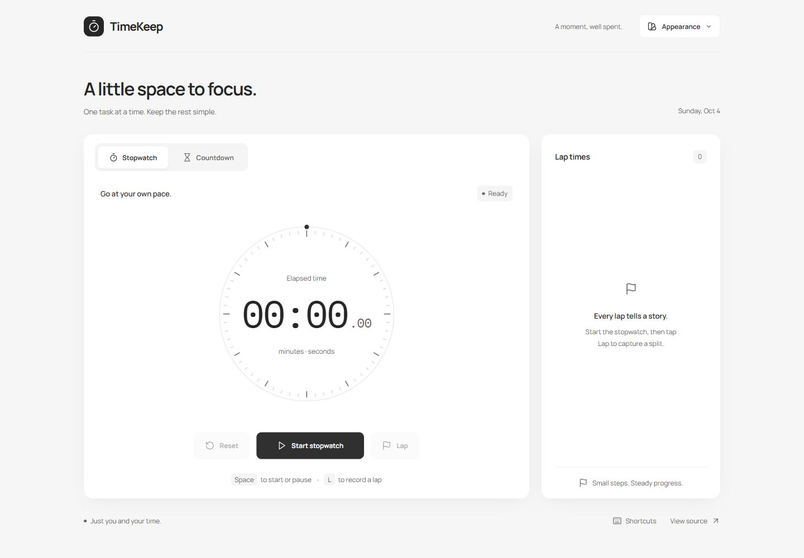

# TimeKeep

A little space to focus. **TimeKeep** is a lightweight stopwatch and countdown workspace built with plain HTML, CSS, and JavaScript.



## Features

- **A soft, neutral workspace.** White, gray, and charcoal are the default. Color appears only after choosing a theme in Appearance.
- **Stopwatch and laps.** Start, pause, resume, and reset; record individual splits alongside total elapsed time. The dial marker tracks the current minute.
- **Countdown timer.** Choose a 5, 10, or 25 minute preset, or enter a duration up to 99 hours, 59 minutes, and 59 seconds. Pause, resume, cancel, and restart after completion.
- **Clear completion feedback.** A progress ring, visible completion state, screen reader announcement, and optional locally generated chime.
- **Independent clocks.** The stopwatch and countdown continue when switching modes.
- **Optional color themes.** Matcha, Berry, Ocean, Sunset, and Lavender. Explicit theme and sound choices are saved on your device when browser storage is available.
- **Responsive and keyboard friendly.** A two-column desktop workspace becomes a stacked mobile layout, with labeled inputs, visible focus, accessible tabs, and reduced-motion support.
- **Local assets.** Fonts and SVG icons are bundled. No CDN scripts, analytics, accounts, or production dependencies.

## Run locally

Clone the repository and serve it with any static HTTP server:

```sh
git clone https://github.com/prezvious/timekeep.git
cd timekeep
python -m http.server 8000
```

Open [localhost:8000](http://localhost:8000). Python 3 is only needed for this example server; the website itself runs in the browser. VS Code Live Server and other static servers also work. Use HTTP rather than opening index.html directly, because the timing code uses JavaScript modules.

## Use the workspace

**Stopwatch:** select Start stopwatch, use Lap to capture splits, pause as needed, and Reset to clear elapsed time and laps.

**Countdown:** choose a preset or edit Hours, Minutes, and Seconds, then select Start countdown. Cancel returns to the same duration for editing. Reset while editing restores the 25 minute default. Start again repeats the completed duration.

**Appearance:** starts in Neutral. Selecting a color theme is an explicit opt-in; selecting Neutral removes color again. Old versions' theme preferences do not automatically opt you into color in this redesign.

**Sound:** use the speaker control in Countdown to enable or mute the completion chime. If the browser cannot play audio, visual completion feedback still works.

| Shortcut                 | Action                                   |
| ------------------------ | ---------------------------------------- |
| Space                    | Start or pause the active clock          |
| L                        | Record a stopwatch lap                   |
| R                        | Reset the active clock                   |
| 1 / 2                    | Select stopwatch / countdown             |
| Left / Right, Home / End | Move between focused mode tabs           |
| Escape                   | Close an appearance or shortcuts popover |

Shortcuts are suspended while editing a duration or using an open popover. Space on a focused button activates that button normally.

## Timing and storage

The stopwatch derives elapsed time from a monotonic clock (`performance.now()`), rather than counting interval ticks. The countdown uses an absolute `Date.now()` deadline and recalculates its remaining time on each update. This avoids accumulated interval drift and catches up after delayed browser updates.

Browser suspension and device sleep can delay refreshes and completion sounds. This is a browser workspace, not a system alarm: keep the page open for a completion cue. Refreshing or closing the page clears running clocks and laps. Only theme and sound preferences persist. Blocking local storage does not prevent the clocks from working.

## Development

There is no build step or package installation. Timing state is separated from the interface so its transitions can be tested without a browser.

```sh
node --test tests/timekeeper.test.mjs
```

Use a current Node.js LTS release for tests. The suite covers pause/resume, lap splits, delayed updates, duration limits, completion, reset, and formatting. For interface changes, also check both modes at desktop and mobile widths, keyboard navigation, appearance persistence, and completion feedback.

```text
index.html             Semantic workspace and controls
style.css              Responsive layout and theme tokens
script.js              UI, keyboard controls, preferences, and chime
timekeeper.mjs         Stopwatch/countdown state and formatting
assets/                Local SVG sprite, favicon, fonts, and licenses
tests/                 Dependency-free timing tests
DESIGN.md              Design system and neutral-default contract
```

## Credits and license

TimeKeep is licensed under the [MIT License](LICENSE).

- [Lucide](https://lucide.dev/) provides the matching SVG icons (v0.468.0). Its [ISC license](assets/icons-LICENSE.txt) and the [Feather MIT license](assets/feather-LICENSE.txt) are included with the assets.
- [Manrope](https://github.com/google/fonts/tree/main/ofl/manrope) and [IBM Plex Mono](https://github.com/google/fonts/tree/main/ofl/ibmplexmono) are bundled under the SIL Open Font License; notices are in assets/fonts.
- The README preview is a screenshot of TimeKeep's implemented neutral workspace.
